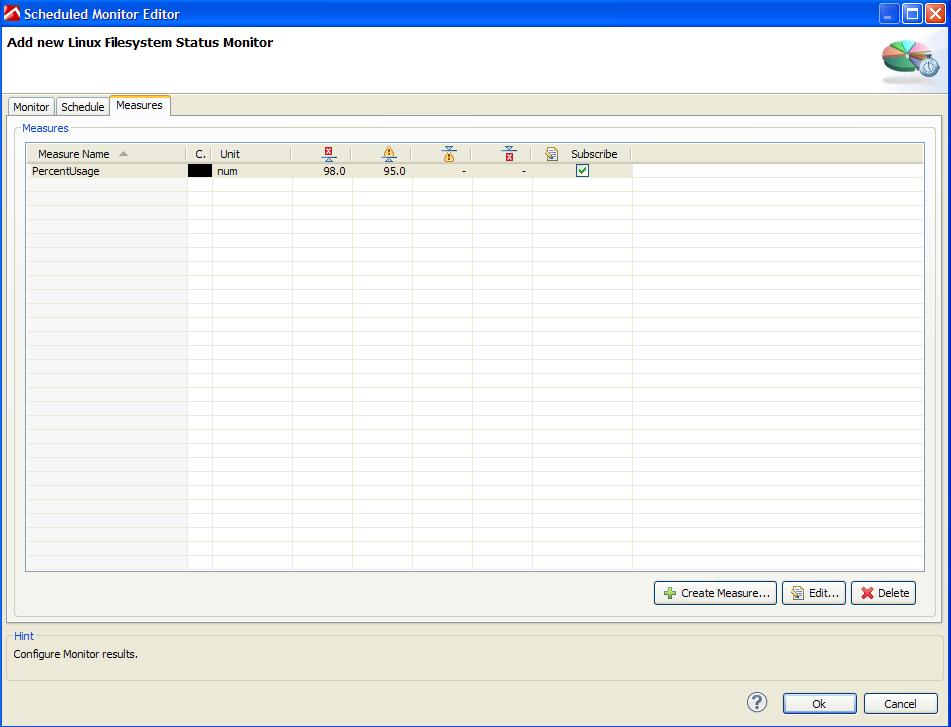

# Linux Filesystem Status Plugin

## Overview

The monitor gets the filesystem percent usage via the df -Plk command. The user credentials entered when configuring the monitor must have ssh access to the remote server you wish to monitor.

Configuration screen for Linux Filesystem Monitor

Measures provided by Linux Filesystem Monitor

## Plugin Details

| Name | Linux Filesystem Status Plugin
| :--- | :---
|Author |Derek Abing
| Supported dynaTrace Version | >= 5.5
|License|[dynaTrace BSD](dynaTraceBSD.txt)
|Support|[Not Supported ](https://community.compuwareapm.com/community/display/DL/Support+Levels#SupportLevels-Community)  
|Release History|2012-03-05 Initial Release
|Download|[Linux Filesystem Status Plugin 1.0.1](com.dynatrace.diagnostics.plugins.LinuxFilesystemStatusPlugin_1.0.1.jar) 

## Provided Measures

  * **PercentUsage**: Returns percentage usage of specified filesystem. 

For further Unix monitoring measures, please refer to the documentation on

[Unix System Monitoring](https://community.compuwareapm.com/community/display/DOCDT50/Unix+System+Monitoring).

## Configuration

Name

Value

Filesystem

Linux filesystem name.

Method

Specify the type of Connection.

Authentication Method

Specify the type of SSH Authentication.

Username

The username that is used for authorization with the host.

Password

The password for the username.

## Installation

Import the Plugin into the dynaTrace Server. For details how to do this please refer to the [dynaTrace
documentation](https://community.compuwareapm.com/community.dynatrace.com/community/display/DOCDT41/Manage+and+Develop+Plugins#ManageandDevelopPlugins-ManageandDevelopPlugins).

